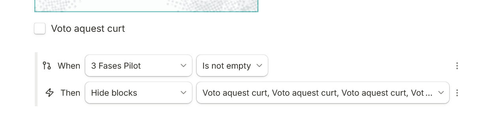
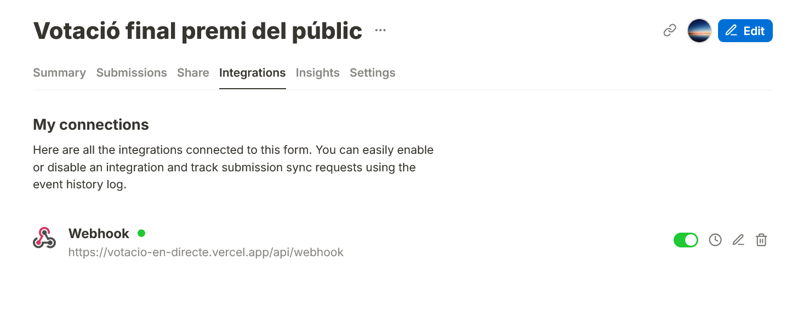

# votacio-en-directe
Web que rep les respostes d'un Tally Forms en directe.

El formulari és el següent (l'he tornat a obrir a mode d'arxiu): https://tally.so/r/w7jyXP.

Aquí un diagrama amb el funcionament de l'aplicació i lògica de la repo:


Per generar el QR s'ha utilitzat una web de codi obert molt xula: [https://mini-qr-code-generator.vercel.app/](https://mini-qr-code-generator.vercel.app/)


### Configuració Tally
Dins del formulari:



Integració webhook:



### Lògica firebase
Tenim a firebase realtime databse una base de dades que és un JSON molt simple:
```
{
  "ahir": 7,
  "fil": 16,
  "patata": 13,
  "pilot": 17,
  "pixapins": 9,
  "remember": 3,
  "twist": 17
}
```
Aquestes dades únicament les modifiquem (escriptura) nosaltres des del servidor (amb firebase admin SDK), és a dir des de la api de la pròpia app nextjs que és `api/webhook.js`. 

Nota: `api/votar.js` és irrellevant, es podria eliminar i tot seguiria funcionant, l'he deixat únicament per si es volen fer proves.

El servidor, al tenir configurat admin SDK no té restriccions (explicació de com configurar-ho al diagrama que hi ha més amunt), això vol dir que pot llegir i escriure tot el que vulgui. El client (és a dir un usuari que utilitza el navegador i entra a la pàgina) no necessita escriure a la base de dades (no hi ha cap botó de votar). Aleshores únicament necessita permissos de lectura (per poder llegir la base de dades i mostrar els vots de manera maca a index.js), és per això que les regles de la base de dades són:
```
{
  "rules": {
    ".read": "true",
    ".write": "false",
  }
}
```

El que s'encarrega de llegir la resposta del formulari de Tally i actualitzar la base de dades és `api/webhook.js`, i ho fa gràcies als permisos Admin SDK de `firebase.js`. El que s'encarrega de mostrar els vots de manera bonica és `index.js`, i ho fa gràcies als permissos de lectura client-side de `firabaseClient.js`.

### Variables d'entorn
L'important és tenir en compte que en local s'han de tenir en un .env.local i a Vercel s'han de tenir a la configuració del projecte a 'Environment Variables'.

Les privades (escriptura server-side via Admin SDK) les oobtenim configurant la firebase a "Project Settings > Service accounts > Firebase admin SDK" i exportant el JSON.

Les públiques (lectura client-side) les obtenim quan afegim una Web App (icona </>) a la base de dades.